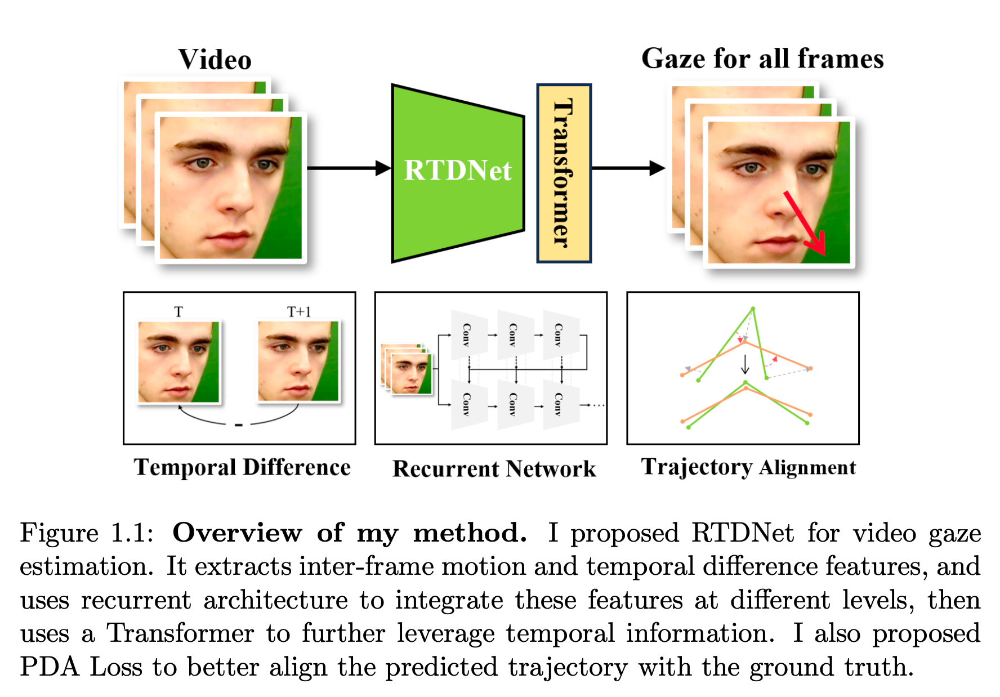
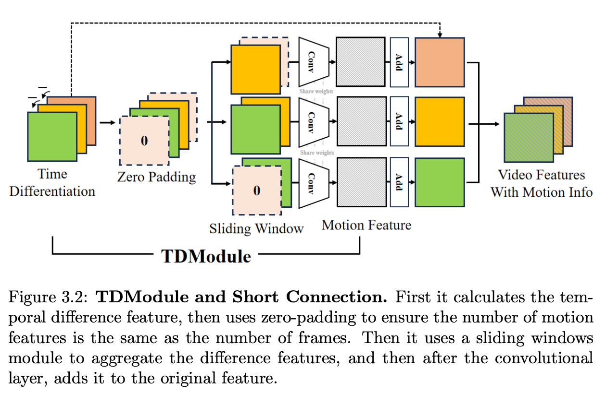
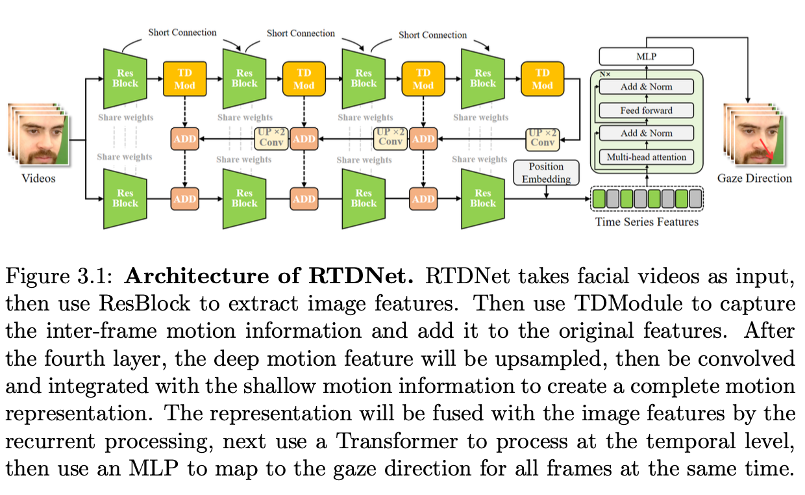
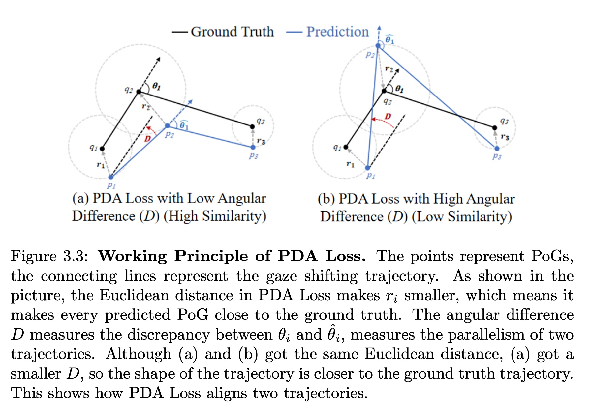
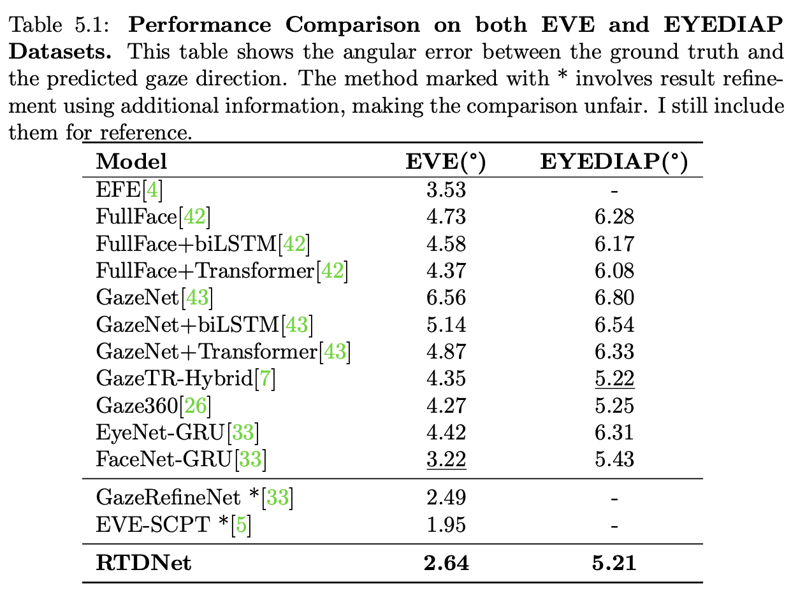

## RTDNet: A Recurrent Network using Temporal Difference for Video Gaze Estimation

### Overview
RTDNet is a recurrent video gaze estimation framework that explicitly models both inter-frame motion and temporal dependencies, and aligns full gaze trajectories over time. It introduces a Temporal Difference Module (TDModule) to capture motion from temporal differences, a recurrent multi-level fusion architecture with upsampling to build complete motion representations, a Transformer encoder for temporal processing, and a Point Distribution Alignment (PDA) loss to align predicted and ground-truth Point-of-Gaze (PoG) sequences at the trajectory level.



### Method highlights
- **Temporal Difference Module (TDModule)**: Computes differences between adjacent frame features, aggregates them via a sliding window, and uses grouped convolution to extract motion features. Zero-padding at sequence ends ensures a 1:1 al
  
- **Recurrent multi-level fusion**: At multiple backbone stages, TDModule-derived motion features are injected into appearance features through short connections; deep motion features are upsampled and fused with shallower ones to form a more complete motion representation that is recurrently added back to image features across levels.
- **Temporal processing (Transformer)**: A lightweight Transformer encoder (1 layer, 8 heads, hidden 512, FFN 1024, GeLU, dropout 0.1) models short- and long-range dependencies in parallel for stable sequence predictions.
    


- **PDA Loss (trajectory alignment)**: Encourages both per-point proximity (Euclidean) and trajectory-shape parallelism (sum of angular differences between consecutive displacement vectors), complementing standard 3D angular loss.

    


### Empirical results (summary)
- **EVE** (validation): RTDNet achieves 2.64° mean angular error.
  - Baseline FaceNet-GRU (our reimplementation): 3.22° → RTDNet improves by ~18.0%.
- **EYEDIAP**: RTDNet achieves 5.21° mean angular error.
  - Baseline FaceNet-GRU: 5.43° → RTDNet improves by ~4.0%.




### Model complexity and runtime
- Parameters: ~14.89M.
- Inference (FP32): ~2.82 GB GPU memory; ~0.03 s per 30-frame clip on RTX 4090-class GPU; ~170 GFLOPs.

### Repository structure
- `core/`: Default configuration, config tracking helpers
- `datasources/`: EVE/EYEDIAP loaders and sequence utilities
- `model/`: Backbones and RTDNet components (e.g., `FaceNetTransformer`)
- `utils/`: Losses (incl. angular and auxiliary), utilities, and W&B setup
- `segmentation_cache/`: Cached EVE sequence segmentations (auto-built if missing)
- `train.py`: Training entry point (periodic checkpointing + final test)
- `eval.py`: Evaluation utilities and entry point

### Requirements
- Python 3.10–3.11 (tested with 3.11)
- CUDA 12.1 environment matching the pinned `torch/torchvision/torchaudio` wheels
- System: ffmpeg and OpenCV runtime

Install Python packages:
```bash
pip install -r requirements.txt
```

Weights & Biases (enabled by default):
- Offline logging: set `WANDB_MODE=offline`
- Disable: set `WANDB_DISABLED=true`

### Data preparation
Datasets used:
- **EVE**: large-scale, multi-camera. We follow the official split; due to test labels being unavailable, validation split is used for reporting.
- **EYEDIAP**: we adopt preprocessing/standardization from prior work and use a 4-fold split (per GazeHub) for fair comparison.

Update dataset paths before running:
- Edit the EVE root used in `train.py` and `eval.py` (e.g., `/root/autodl-tmp/eve_dataset/eve_dataset`) to your local path.
- Optional defaults (e.g., frame rate 10 Hz, sequence length 30, `camera_frame_type='face'`) can be set in `core/config_default.py`. Ensure call sites and defaults are consistent.

Preprocessing (high level):
- Face crops at 256×256; 30-frame clips sampled at 10 Hz. Training uses standardization w.r.t. camera coordinates (per prior work), while inference may omit camera pose if unavailable.
- Invalid frames (no-face/closed-eye) are filtered by the dataset tools.

### Training
Entry point:
```bash
python train.py
```

Defaults and tips:
- Backbone: `FaceNetTransformer` (see `model/facenet_transformer.py`).
- Optimizer: Adam, weight decay 0.005; batch size 16; ≤10 epochs.
- Learning rate: 5e-4 (EVE), 1e-4 (EYEDIAP) as typical settings.
- TDModule hyperparameters: sliding window `w=5`, `s=1`; zero-padding `m=2`, `n=3`; nearest-neighbor upsampling; learnable positional embeddings.
- Losses: `L = L_angular + γ L_PDA`, with `γ=5e-4`, `λ=1` inside PDA.
- Checkpoints auto-saved to `saving/` (also logged to W&B artifacts).

### Evaluation
Two ways:
- After training, `train.py` runs a final test on EVE validation and logs summary metrics.
- To evaluate a specific checkpoint, edit the `path = "..."` in `eval.py` (or call `do_final_test(path)`) and run:
```bash
python eval.py
```
The script reports per-batch angular error (degrees) and the final mean.

### Demo (separate project)
An interactive web demo was built to visualize online inference and trajectories (Frontend: Vue 3; Backend: FastAPI). It is maintained separately and not included in this codebase.

### Reproducibility
- Seeds are set in scripts for partial reproducibility. For stricter determinism, enable `fully_reproducible` in `core/config_default.py` and use deterministic CUDA flags (note potential speed/accuracy trade-offs).

### Ethics and licensing
- EVE (ETH Zurich) is CC BY-NC-SA 4.0 and GDPR-compliant; this project respects non-commercial use and data access policies.
- EYEDIAP requires academic access; all experiments adhere to its usage terms.
- Some source files include MIT-style headers from upstream; see per-file notices.

### Citation
If you find this work useful, please cite RTDNet:
```bibtex
@misc{Shi2025RTDNet,
  title  = {RTDNet: A Recurrent Network using Temporal Difference for Video Gaze Estimation},
  author = {Linli Shi and Yihua Cheng and Hyung Jin Chang},
  year   = {2025},
  note   = {University of Birmingham BSc Final Year Project Report},
}
```


